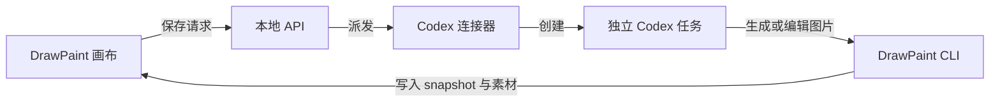

# DrawPaint

DrawPaint 是一个面向 **Codex 桌面版** 的本地无限画布。它基于 [tldraw](https://github.com/tldraw/tldraw)，用于构思、标注、生成图片，以及把完整游戏 UI 拆成可编辑、可导出的独立素材。

画布把请求直接派发成 Codex 独立任务。普通画布和「UI 素材」共用同一个 Codex 连接器，不需要 Cursor deeplink、Cursor 命令或 Cursor Skills，也不需要额外填写生图 API Key。

## 功能

- **AI 图片框**：按选中框的位置、尺寸和比例生成图片，并自动替换占位框。
- **标注改图**：导出原图与箭头、文字的标注截图；Codex 生成干净新图并放到原图右侧，保留原图和标注。
- **UI 素材工坊**：生成或导入完整界面，拆成独立图层，校正名称、类型、范围和层序，再回填画布。
- **候选验收**：逐层对照原图，只重做不满意的组件，确认后再发布。
- **项目交付**：导出 PNG + `manifest.json` ZIP、PSD 和 Unity PNG 包。
- **本地保存**：画布、截图、任务和生成素材保存在项目的 `canvas/` 目录。

素材工坊的完整流程见 [UI 素材模式使用说明](docs/ui-studio.md)，验证范围见 [测试说明](docs/ui-testing.md)。

## 安装

仓库地址：<https://github.com/dsmiling/DrawPaint>

可以直接让 Codex 在本机执行：

```text
请从 https://github.com/dsmiling/DrawPaint.git 安装 DrawPaint，
进入项目后执行 npm install，并运行 npm run dev。
然后在当前 Codex 桌面任务中运行 npm run agent，保持连接器运行。
```

也可以手动安装：

```bash
git clone https://github.com/dsmiling/DrawPaint.git
cd DrawPaint
npm install
```

## 启动

DrawPaint 需要两个长期运行的进程。

### 1. 启动画布

```bash
npm run dev
```

打开：

- 普通画布：<http://127.0.0.1:43217>
- UI 素材工坊：<http://127.0.0.1:43217/?mode=ui>

`npm run dev` 同时启动 Vite 前端和本地 API。默认端口分别为 `43217` 和 `43218`。

### 2. 连接 Codex

在打开本仓库的 **Codex 桌面任务**中运行：

```bash
npm run agent
```

连接器必须从 Codex 桌面任务启动，因为它使用当前 Codex 会话提供的本地任务通道。连接成功后，画布提交的每个生成或拆分请求都会创建独立 Codex 任务；任务完成后保留，方便检查过程和结果。

如果页面提示“Agent 尚未连接”，回到 Codex 任务重新运行 `npm run agent`。关闭连接器会停止新的任务派发，但不会删除画布数据或已经生成的结果。

## 使用

### 生成新图

1. 点击顶部 **AI 图片**，创建并选中占位框。
2. 选择比例，输入提示词，可选画布图片或本地图片作为参考。
3. 点击发送。画布会保存请求并直接创建 Codex 独立任务。
4. Codex 生成图片后自动替换占位框；打开着的画布会刷新结果。

### 根据标注修改图片

1. 用画笔、箭头或文字在图片附近标注修改要求。
2. 选中底图，点击 **按标注修改**。
3. 可补充提示词和参考图，然后提交。
4. Codex 读取标注截图和引用素材，生成没有标注痕迹的新图，并放到原图右侧。

### 制作 UI 素材

1. 点击顶部 **UI 素材**，导入完整界面或创建生成任务。
2. 审阅组件拆解方案，校正范围、名称、类型、文字和层级。
3. 生成独立图层，并在候选验收中逐层检查或局部重做。
4. 确认后回填画布，或导出 PSD、Unity 包及 PNG 清单。

## Codex 工作流



普通画布任务使用 `scripts/drawpaint.mjs` 回填结果；UI 素材任务使用 `scripts/ui-studio.mjs`。这些命令由新建的 Codex 任务自动执行，日常使用无需手动调用。

## 本地部署

```bash
git clone https://github.com/dsmiling/DrawPaint.git
cd DrawPaint
npm ci
npm run build
npm run test:ui
npm run dev
```

随后在 Codex 桌面任务中启动 `npm run agent`。

运行数据默认写入 `canvas/`。若要把数据放在其他目录，启动画布和连接器前设置相同的 `DRAWPAINT_PROJECT_DIR`：

```powershell
$env:DRAWPAINT_PROJECT_DIR = 'D:\DrawPaintData'
npm run dev
```

另一个 Codex 桌面任务也设置同一变量后运行：

```powershell
$env:DRAWPAINT_PROJECT_DIR = 'D:\DrawPaintData'
npm run agent
```

服务默认只绑定 `127.0.0.1`。如需供内网使用，应增加反向代理、身份认证和 HTTPS，并把 `/api` 转发到 API 端口 `43218`。

## 更新

```bash
git pull
npm install
npm run build
npm run test:ui
```

更新后重启 `npm run dev` 和 `npm run agent`。`canvas/` 中的运行数据已被 Git 忽略，不会被更新覆盖；迁移设备时请单独备份。

## 本地开发

```bash
npm run dev       # 画布前端 + API
npm run agent     # Codex 桌面连接器，须从 Codex 任务启动
npm run build     # 生产构建
npm run test:ui   # 工作流测试
npm run preview   # 预览生产构建
npm run server    # 仅启动本地 API
```

### 环境变量

| 变量 | 含义 |
| --- | --- |
| `DRAWPAINT_PORT` | 画布 Web 端口，默认 `43217` |
| `DRAWPAINT_API_PORT` | API 端口，默认 `43218` |
| `DRAWPAINT_PROJECT_DIR` | 画布数据所在项目目录 |

### 目录结构

```text
DrawPaint/
├── src/                         # React + tldraw 前端
├── server/                      # 本地 API、存储和 UI 素材工作流
├── scripts/
│   ├── ui-agent-bridge.mjs      # Codex 桌面连接器
│   ├── drawpaint.mjs            # 普通画布任务回填 CLI
│   └── ui-studio.mjs            # UI 素材任务 CLI
├── docs/                        # 使用与测试说明
└── canvas/                      # 本地运行数据（大部分已 gitignore）
```

## 当前边界

- Codex 桌面应用和连接器需要在同一台机器运行。
- 每个请求会创建独立 Codex 任务，方便隔离上下文和检查结果。
- 连接器进程退出后，新的请求无法派发；重启连接器即可恢复。
- 图像生成结果仍需人工检查，特别是文字、透明边缘、字体和图层复原。
