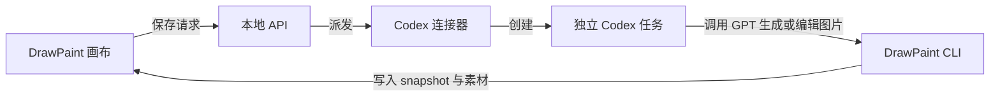

# DrawPaint

> 支持 Codex / GPT 与本地 Qwen-Image-2.1 的 AI 视觉画布：从灵感、生图和改图，到 UI 切图、分层与项目交付。

DrawPaint 基于 [tldraw](https://github.com/tldraw/tldraw)，把自由画布、AI 图片生成和游戏 UI 素材生产整合到一个本地工作台中。你可以在画布上整理灵感与参考图，通过文字或可视化标注生成、修改图片，也可以从完整 UI 效果图继续拆出可编辑、可复用、可导出的独立图层。

绘画画布和素材工坊可以选择 **Codex / GPT** 或 **本地 Qwen-Image-2.1**。Codex 请求派发为独立任务；本地 Qwen 请求通过 ComfyUI 直接执行，不需要图片 API Key 或 Agent 连接。两条路径都由 DrawPaint 回填结果、管理素材和导出工程；语义拆解、分类及 AI 分层继续由 Codex 完成。不再依赖旧版 Cursor deeplink、Cursor 命令或 Cursor Skills。

## 核心能力

- **画布生图**：在无限画布中创建 AI 图片框，按指定位置、尺寸和比例生成图片，并自动替换占位框。
- **参考图与标注改图**：结合画布素材、本地图片、箭头和文字标注进行局部修改，同时保留原图与修改上下文。
- **完整 UI 生成**：从描述或参考图生成游戏界面效果图，也可以直接导入现有设计继续处理。
- **智能切图与 AI 分层**：识别 UI 组件，去除背景，将重叠或不完整元素还原成独立高清图层，并保留坐标、尺寸和层级关系。
- **图层审阅与局部重做**：逐层对照原始效果图，仅重新生成不满意的组件，避免整套素材重复生图。
- **素材复用与版本管理**：在已有任务中查找匹配组件，复用合格素材，并追踪来源、版本和父子关系。
- **工程化交付**：导出 PNG + `manifest.json`、PSD 和 Unity UI 包，可继续编辑或直接进入项目制作流程。
- **视频工坊**：使用本机 ComfyUI 图生视频，导入和剪辑片段，在节点画布与多轨时间线上整理素材，并导出包含原片音频的 MP4。
- **本地优先**：画布、截图、任务记录和生成素材均保存在项目的 `canvas/` 目录中。

## 工作方式

```text
灵感 / 参考图 / UI 描述
        ↓
Codex 独立任务 + GPT 视觉生成与编辑
        ↓
DrawPaint 回填、切图、分层与审阅
        ↓
PNG / PSD / Unity UI 包
```

素材工坊的完整流程见 [UI 素材模式使用说明](docs/ui-studio.md)，验证范围见 [测试说明](docs/ui-testing.md)。
视频生成、模型准备和剪辑流程见 [视频工坊使用说明](docs/video-studio.md)。
原型、生图、生视频、透明帧导出与边界验收见 [端到端帧动画规范](docs/video-studio.md#端到端帧动画规范)。
本地 Qwen 的模型准备、生成与验证见 [本地 Qwen 生图说明](docs/qwen-images.md)。

## 安装

仓库地址：<https://github.com/dsmiling/DrawPaint>

可以直接让 Codex 在本机执行：

```text
请从 https://github.com/dsmiling/DrawPaint.git 安装 DrawPaint，
进入项目后执行 npm install，并运行 npm run dev。
然后在当前 Codex 桌面任务中运行 npm run agent，保持连接器运行。
```

也可以手动安装：

```bash
git clone https://github.com/dsmiling/DrawPaint.git
cd DrawPaint
npm install
```

## 启动

使用 Codex 时启动画布和连接器；使用本地 Qwen 时启动画布和 ComfyUI。

### 1. 启动画布

```bash
npm run dev
```

打开：

- 普通画布：<http://127.0.0.1:43217>
- UI 素材工坊：<http://127.0.0.1:43217/?mode=ui>
- 视频工坊：<http://127.0.0.1:43217/?mode=video>

`npm run dev` 同时启动 Vite 前端和本地 API。默认端口分别为 `43217` 和 `43218`。

### 2. 连接 Codex

在打开本仓库的 **Codex 桌面任务**中运行：

```bash
npm run agent
```

连接器必须从 Codex 桌面任务启动，因为它使用当前 Codex 会话提供的本地任务通道。连接成功后，画布提交的每个生成或拆分请求都会创建独立 Codex 任务；任务完成后保留，方便检查过程和结果。

如果页面提示“Agent 尚未连接”，回到 Codex 任务重新运行 `npm run agent`。关闭连接器会停止新的任务派发，但不会删除画布数据或已经生成的结果。

## 使用

### 生成新图

1. 点击顶部 **AI 图片**，创建并选中占位框。
2. 选择比例，输入提示词，可选画布图片或本地图片作为参考。
3. 在顶部“生图模型”选择 Codex / GPT 或本地 Qwen-Image-2.1，然后发送。
4. 图片生成后自动替换占位框；打开着的画布会刷新结果。

### 根据标注修改图片

1. 用画笔、箭头或文字在图片附近标注修改要求。
2. 选中底图，点击 **按标注修改**。
3. 可补充提示词和参考图，然后提交。
4. Codex 读取标注截图和引用素材，生成没有标注痕迹的新图，并放到原图右侧。

### 制作 UI 素材

1. 点击顶部 **UI 素材**，导入完整界面或创建生成任务。
2. 审阅组件拆解方案，校正范围、名称、类型、文字和层级。
3. 生成独立图层，并在候选验收中逐层检查或局部重做。
4. 确认后回填画布，或导出 PSD、Unity 包及 PNG 清单。

## Codex / GPT 工作流


```mermaid
flowchart LR
    A[DrawPaint 画布] -->|保存请求| B[本地 API]
    B -->|派发| C[Codex 连接器]
    C -->|创建| D[独立 Codex 任务]
    D -->|调用 GPT 生成或编辑图片| E[DrawPaint CLI]
    E -->|写入 snapshot 与素材| A
```

普通画布任务使用 `scripts/drawpaint.mjs` 回填结果；UI 素材任务使用 `scripts/ui-studio.mjs`。这些命令由新建的 Codex 任务自动执行，日常使用无需手动调用。

## 本地部署

```bash
git clone https://github.com/dsmiling/DrawPaint.git
cd DrawPaint
npm ci
npm run build
npm run test:ui
npm run dev
```

随后在 Codex 桌面任务中启动 `npm run agent`。

运行数据默认写入 `canvas/`。若要把数据放在其他目录，启动画布和连接器前设置相同的 `DRAWPAINT_PROJECT_DIR`：

```powershell
$env:DRAWPAINT_PROJECT_DIR = 'D:\DrawPaintData'
npm run dev
```

另一个 Codex 桌面任务也设置同一变量后运行：

```powershell
$env:DRAWPAINT_PROJECT_DIR = 'D:\DrawPaintData'
npm run agent
```

服务默认只绑定 `127.0.0.1`。如需供内网使用，应增加反向代理、身份认证和 HTTPS，并把 `/api` 转发到 API 端口 `43218`。

## 更新

```bash
git pull
npm install
npm run build
npm run test:ui
```

更新后重启 `npm run dev` 和 `npm run agent`。`canvas/` 中的运行数据已被 Git 忽略，不会被更新覆盖；迁移设备时请单独备份。

## 本地开发

```bash
npm run dev       # 画布前端 + API
npm run agent     # Codex 桌面连接器，须从 Codex 任务启动
npm run build     # 生产构建
npm run test:ui   # 工作流测试
npm run test:video # 视频模型、时间线和素材持久化测试
npm run test:qwen  # 本地 Qwen 接入、任务恢复和素材导出测试
npm run preview   # 预览生产构建
npm run server    # 仅启动本地 API
```

### 环境变量

| 变量 | 含义 |
| --- | --- |
| `DRAWPAINT_PORT` | 画布 Web 端口，默认 `43217` |
| `DRAWPAINT_API_PORT` | API 端口，默认 `43218` |
| `DRAWPAINT_PROJECT_DIR` | 画布数据所在项目目录 |
| `DRAWPAINT_COMFY_URL` | 本机 ComfyUI 地址，默认 `http://127.0.0.1:8188` |

### 目录结构

```text
DrawPaint/
├── src/                         # React + tldraw 前端
├── server/                      # 本地 API、存储和 UI 素材工作流
├── scripts/
│   ├── ui-agent-bridge.mjs      # Codex 桌面连接器
│   ├── drawpaint.mjs            # 普通画布任务回填 CLI
│   └── ui-studio.mjs            # UI 素材任务 CLI
├── docs/                        # 使用与测试说明
└── canvas/                      # 本地运行数据（大部分已 gitignore）
```

## 当前边界

- Codex 路径需要桌面应用和连接器在同一台机器运行，每个请求创建独立任务。
- 本地 Qwen 生图和参考图编辑需要 ComfyUI 与模型就绪；语义拆解、分类和 AI 分层需要 Agent。
- 连接器进程退出后，Codex 请求无法派发；本地 Qwen 生图仍可使用。
- 图像生成结果仍需人工检查，特别是文字、透明边缘、字体和图层复原。
